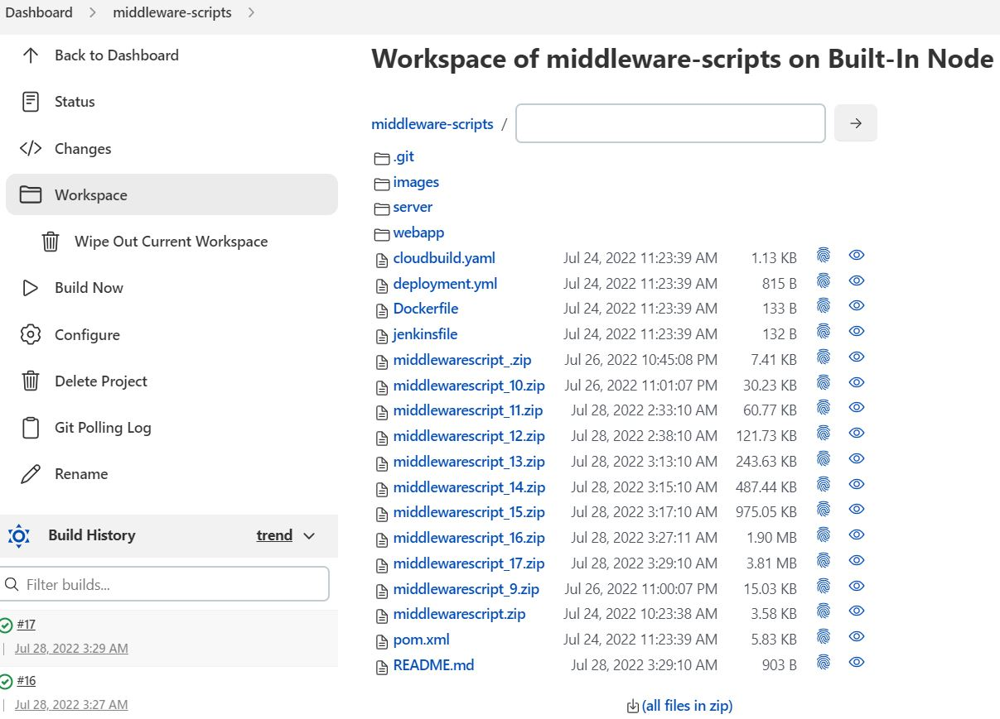

# Jenkins Practice Project

### 1. Maven Project practice
* Maven was configured in the newly formed Jenkins System to help build jobs.

### 2. .zip (buiding of artifact)

* `# yum install zip` into the redhat server (EC2)
* The project is used to built jobs in Jenkins for practice. Each commit (according to the configuration in Jenkins) should lead to an automatic built of a job.
* a new .zip (artifact) file is generated after each built.

* In the execute shell the command is: `zip middlewarescript_${BUILT_NUMBER}.zip *`

* The buit should be automatic after each commit. 
* Every single change (and commit) triggers the creation of an artifact.

* like this one
* More artifact weere created as the result of adding and commiting jpeg to the read.me files

